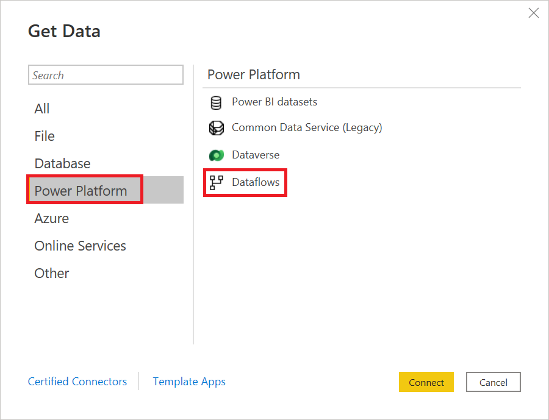

# Dataflows

## Summary

| Item | Description |
| ---- | ----------- |
| Release State | General Availability |
| Products | Power BI (Datasets) Power BI (Dataflows) Power Apps (Dataflows) Dynamics 365 Customer Insights (Dataflows) Excel|
| Authentication types | Organizational account |
| | |

>[!Note]
>Some capabilities may be present in one product but not others due to deployment schedules and host-specific capabilities.

## Prerequisites

You must have an existing Dataflow with maker permissions to access the portal, and read permissions to access data from the dataflow.

## Capabilities supported

* Import
* DirectQuery (Power BI Desktop only)

>[!Note]
>DirectQuery requires Power BI premium. More information: [Premium features of dataflows](/power-bi/transform-model/dataflows/dataflows-premium-features)

## Get data from Dataflows in Power BI Desktop

To get data from Dataflows in Power BI Desktop:

1. Select **Get data** from the **Home** tab.

2. In the **Get Data** dialog box, select **Power Platform > Dataflows**, and then select **Connect**.

   

3. If this attempt is the first time you're connecting to this site, select **Sign in** and input your credentials. Then select **Connect**.

   

4. In **Navigator**, select the Dataflow you require, then either load or transform the data.

   

## Get data from Dataflows in Power Query Online

To get data from Dataflows in Power Query Online:

1. From the **Data sources** page, select **Dataflows**.

   

2. Adjust the connection name.

   

3. If necessary, enter an on-premises data gateway if you're going to be using on-premises data. For example, if you're going to combine data from Dataflows and an on-premises SQL Server database.

4. Sign in to your organizational account.

5. When you've successfully signed in, select **Next**.

6. In the navigation page, select the data you require, and then select **Transform Data**.

## Frequently asked questions

_**DirectQuery is not working for me in Power BI&mdash;what should I do?**_

To get DirectQuery to run, you need to have Power BI Premium and adjust a few configuration items in your Power BI workspace. These actions are explained in the [dataflows premium features](/power-bi/transform-model/dataflows/dataflows-premium-features) article.

_**My dataflow table doesn't show up in the dataflow connector in Power BI**_

You're probably using a Dataverse table as the destination for your standard dataflow. Use the [Dataverse/CDS connector](../Connectors/Dataverse.md) instead or consider switching to an analytical dataflow.

_**There's a difference in the data when I remove duplicates in dataflows&mdash;how can I resolve this?**_

There could be a difference in data between design-time and refresh-time. We don't guarantee which instance is being kept during refresh time. For information on how to avoid inconsistencies in your data, go to [Working with duplicates](../working-with-duplicates.md).

### See also

* [Using the output of Dataflows from other Power Query experiences](../dataflows/using-output-power-platform-dataflows-other-azure.md)
* [Best practices for designing and developing complex dataflows](../dataflows/best-practices-developing-complex-dataflows.md)
* [Best practices for reusing dataflows across environments and workspaces](../dataflows/best-practices-reusing-dataflows.md)
