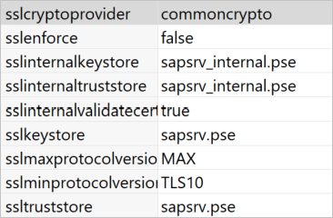
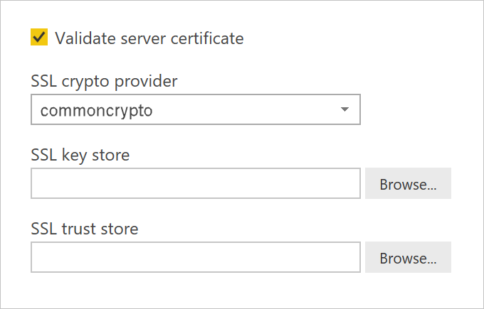
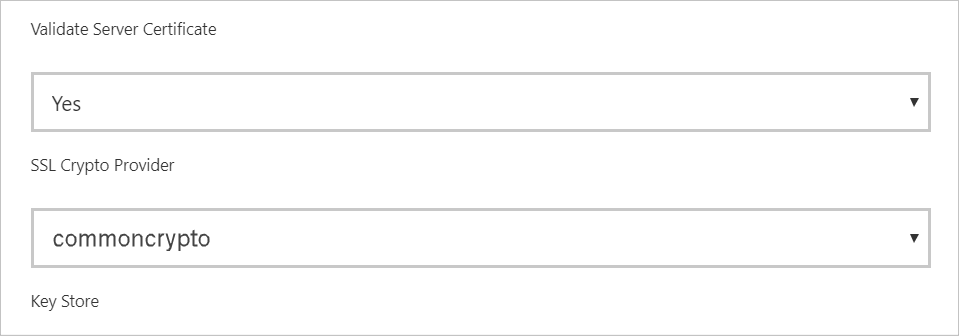

# Enable encryption for SAP HANA

We recommend that you encrypt connections to an SAP HANA server from Power Query Desktop and Power Query Online. You can enable HANA encryption using SAP's proprietary CommonCryptoLib (formerly known as sapcrypto) library. SAP recommends using CommonCryptoLib.

>[!Note]
>SAP no longer supports the OpenSSL, and as a result, Microsoft also has discontinued its support. Use CommonCryptoLib instead.

This article provides an overview of enabling encryption using CommonCryptoLib, and references some specific areas of the SAP documentation. We update content and links periodically, but for comprehensive instructions and support, always refer to the official SAP documentation. Use CommonCryptoLib to set up encryption instead of OpenSSL; for steps to do so, go to [How to Configure TLS/SSL in SAP HANA 2.0](https://blogs.sap.com/2018/11/13/how-to-configure-tlsssl-in-sap-hana-2.0/). For steps on how to migrate from OpenSSL to CommonCryptoLib, go to [SAP Note 2093286](https://launchpad.support.sap.com/#/notes/2093286) (s-user required).

> [!NOTE]
> The setup steps for encryption detailed in this article overlap with the setup and configuration steps for SAML SSO. Use CommonCryptoLib as your HANA server's encryption provider, and make sure that your choice of CommonCryptoLib is consistent across SAML and encryption configurations.

There are four phases to enabling encryption for SAP HANA. We cover these phases next. More information: [Securing the Communication between SAP HANA Studio and SAP HANA Server through SSL](https://blogs.sap.com/2015/09/28/securing-the-communication-between-sap-hana-studio-and-sap-hana-server-through-ssl/)

## Use CommonCryptoLib

Ensure your HANA server is configured to use CommonCryptoLib as its cryptographic provider.

## Create a certificate signing request

Create an X509 certificate signing request for the HANA server.

1. Using SSH, connect to the Linux machine that the HANA server runs on as \<sid\>adm.

2. Go to the Home directory _/usr/sap/\<sid\>/home/.ssl_. The hidden .ssl file already exists if the root CA has already been created.

    If you don't already have a CA you can use, you can create a root CA yourself by following the steps outlined in [Securing the Communication between SAP HANA Studio and SAP HANA Server through SSL](https://blogs.sap.com/2015/09/28/securing-the-communication-between-sap-hana-studio-and-sap-hana-server-through-ssl/).

3. Run the following command:

    **sapgenpse gen_pse -p cert.pse -r csr.txt -k GN-dNSName:\<_HOSTNAME with FQDN_> "CN=\<_HOSTNAME with FQDN_>"**

This command creates a certificate signing request and private key. Fill in \<_HOSTNAME with FQDN_> with the host name and fully qualified domain name (FQDN).

## Get the certificate signed

Get the certificate signed by a certificate authority (CA) that is trusted by the client(s) you'll use to connect to the HANA server.

1. If you already have a trusted company CA (represented by CA\_Cert.pem and CA\_Key.pem in the following example), sign the certificate request by running the following command:

    **openssl x509 -req -days 365 -in csr.txt -CA CA_Cert.pem -CAkey CA_Key.pem -CAcreateserial -out cert.pem**

2. Copy the new file, cert.pem, to the server.

3. Create the HANA server certificate chain:

    **sapgenpse import_own_cert -p cert.pse -c cert.pem**

4. Restart the HANA server.

5. Verify the trust relationship between a client and the CA you used to sign the SAP HANA server's certificate.

    The client must trust the CA used to sign the HANA server's X509 certificate before an encrypted connection can be made to the HANA server from the client's machine.

    There are various ways to ensure this trust relationship exists using Microsoft Management Console (mmc) or the command line. You can import the CA's X509 certificate (cert.pem) into the **Trusted Root Certification Authorities** folder for the user that will establish the connection, or into the same folder for the client machine itself, if that is desirable.

    

    You must first convert cert.pem into a .crt file before you can import the certificate into the Trusted Root Certification Authorities folder.

## Test the connection

>[!Note]
> Before using the procedures in this section, you must be signed in to Power BI using your admin account credentials.

Before you can validate a server certificate in the Power BI service online, you must have a data source already set up for the [on-premises data gateway](/data-integration/gateway/). If you don't already have a data source set up to test the connection, you'll have to create one. To set up the data source on the gateway:

1. From the Power BI service, select the  setup icon.

2. From the drop-down list, select **Manage gateways**.

3. Select the ellipsis (...) next to the name of the gateway you want to use with this connector.

4. From the drop-down list, select **Add data source**.

5. In **Data Source Settings**, enter the data source name you want to call this new source in the **Data Source Name** text box.

6. In **Data Source Type**, select **SAP HANA**.

7. Enter the server name in **Server**, and select the authentication method.

8. Continue following the instructions in the next procedure.

Test the connection in Power BI Desktop or the Power BI service.

1. In Power BI Desktop or in the **Data Source Settings** page of the Power BI service, ensure that **Validate server certificate** is enabled before attempting to establish a connection to your SAP HANA server. For **SSL crypto provider**, select commoncrypto. Leave the SSL key store and SSL trust store fields blank.

    - Power BI Desktop

        

    - Power BI service

        

2. Verify that you can successfully establish an encrypted connection to the server with the **Validate server certificate** option enabled, by loading data in Power BI Desktop or refreshing a published report in Power BI service.

You'll note that only the **SSL crypto provider** information is required. However, your implementation might require that you also use the key store and trust store. For more information about these stores and how to create them, go to [Client-Side TLS/SSL Connection Properties (ODBC)](https://help.sap.com/viewer/b3ee5778bc2e4a089d3299b82ec762a7/2.0.03/en-US/0ae2b75266df44499d8fed8035e024ad.html).

## Additional information

- [Server-Side TLS/SSL Configuration Properties for External Communication (JDBC/ODBC)](https://help.sap.com/viewer/b3ee5778bc2e4a089d3299b82ec762a7/2.0.04/en-US/64065bc94ccb4f64bfb544686db23e60.html)

## Next steps

- [Configure SSL for ODBC client access to SAP HANA](configure-odbc-sap-hana.md)